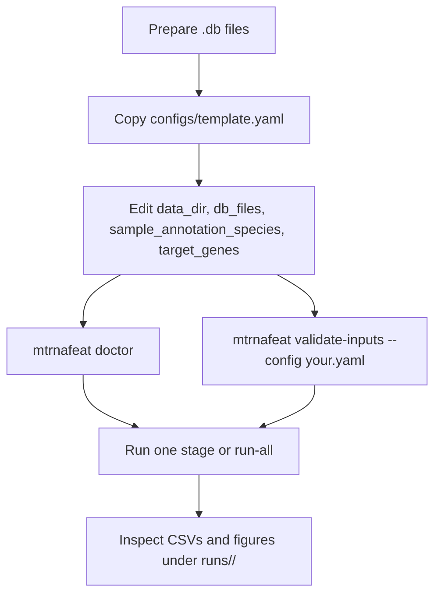

# Getting started

This guide is the practical runbook for using `mtrnafeat`: what files to
prepare, how to write the config, which command to run, and where to look
for the first outputs. For every field-level option, see
[CONFIG.md](CONFIG.md). For every stage output, see [STAGES.md](STAGES.md)
and [FIGURES.md](FIGURES.md).

## Workflow map



## What to prepare

### Required

1. Python 3.11 or newer.
2. ViennaRNA Python bindings (`viennarna`), required by folding stages.
3. One or more `.db` files. Each file is one sample, condition, species,
   or replicate group.
4. A YAML config that points to those `.db` files.

### Optional

1. RNAstructure plus `DATAPATH`, only needed if `fold_engine: rnastructure`
   is used for the `window` stage.
2. A PAL2NL yeast-human COX1 alignment, only needed for `compare`.
3. DrTransformer, only needed for `kinetic`.
4. `adjustText`, useful for cleaner labels in dense plots.

## Install

```bash
git clone https://github.com/Ahram-Ahn/mtRNAFeat.git
cd mtRNAFeat
python -m venv .venv
source .venv/bin/activate
pip install -e .
```

Useful extras:

```bash
pip install -e '.[dev]'      # pytest + ruff
pip install -e '.[labels]'   # better label placement
pip install -e '.[kinetic]'  # DrTransformer wrapper dependency
```

If `pip install viennarna` is not available for your platform, install
ViennaRNA from bioconda:

```bash
conda install -c bioconda viennarna
```

## `.db` input format

Each `.db` file contains one or more 3-line records:

```text
>COX1: -150.4 kcal/mol
GUAGCUAUCAGCAUC...
((((....))))....
```

Rules:

- Header starts with `>` and contains the gene name. The energy after
  `:` is allowed but is not trusted for thermodynamic comparisons.
- Sequence must be RNA or DNA letters; `T` is converted to `U`.
- Dot-bracket length must exactly match sequence length.
- Brackets must be balanced.
- One `.db` file can hold many genes; missing target genes are skipped.

Important: `mtrnafeat` treats dot-brackets as DMS-derived or
DMS-constrained structural models. It does not process FASTQ files and it
does not infer DMS reactivity profiles.

## Config examples

Start by copying the annotated template:

```bash
cp configs/template.yaml configs/my-run.yaml
```

### Example 1: built-in Human + Yeast run

```yaml
data_dir: data
outdir: runs/human_yeast
db_files:
  Human: human_mt-mRNA_all.db
  Yeast: yeast_mt-mRNA_all.db
fold_engine: vienna
target_genes: [COX1, COX2, COX3, ATP86, CYTB, ND1, ND2, ND3, ND4L4, ND5, ND6, ATP9, COB, VAR1]
```

With exactly `Human` and `Yeast` labels, `run-all` also runs the
comparison-only stages `compare` and `substitution`.

### Example 2: independent multi-sample run

Use this layout for multiple yeast KOs and human treatments. These
samples are analyzed independently; `compare` and `substitution` are not
run by default.

```yaml
data_dir: data/my_experiment
outdir: runs/my_experiment

db_files:
  Yeast_WT: yeast_wt.db
  Yeast_KO1: yeast_ko1.db
  Yeast_KO2: yeast_ko2.db
  Yeast_KO3: yeast_ko3.db
  Human_Control: human_control.db
  Human_CAP: human_chloramphenicol.db

# Optional when labels already contain "Yeast" or "Human", but explicit is clearer.
sample_annotation_species:
  Yeast_WT: Yeast
  Yeast_KO1: Yeast
  Yeast_KO2: Yeast
  Yeast_KO3: Yeast
  Human_Control: Human
  Human_CAP: Human

fold_engine: vienna
target_genes: [COX1, COX2, COX3, ATP86, CYTB, ND1, ND2, ND3, ND4L4, ND5, ND6, ATP9, COB, VAR1]
```

For this run, the useful stages are:

```text
landscape, local-probability, structure-deviation, gene-panel,
tis, window, features, cofold
```

The default `run-all` behavior matches that: it skips `compare` and
`substitution` unless you explicitly add `--include-comparison`.

### Example 3: one-gene debug run

```yaml
data_dir: data
outdir: runs/cox1_debug
db_files:
  Yeast_WT: yeast_wt.db
sample_annotation_species:
  Yeast_WT: Yeast
target_genes: [COX1]
sim_num_sequences: 100
gradient_steps: 5
gradient_seqs_per_step: 20
fold_engine: vienna
plot_format: png
```

This is useful when checking that a new `.db` file parses correctly.

## Run commands

### 1. Check the installation

```bash
mtrnafeat doctor --config configs/my-run.yaml
```

`doctor` checks Python, ViennaRNA, RNAplfold, RNAstructure, and
DrTransformer. Missing optional tools are reported, but only required
tools fail the command.

### 2. Validate inputs before expensive work

```bash
mtrnafeat validate-inputs --config configs/my-run.yaml
```

This catches common input mistakes: missing files, sequence/structure
length mismatch, unbalanced brackets, non-ACGU characters, and annotation
warnings.

### 3. Run the independent sample pipeline

```bash
mtrnafeat run-all --config configs/my-run.yaml --outdir runs/my-run -- --parallel
```

For arbitrary sample labels, this runs:

```text
stats, landscape, features, window, local_probability,
structure_deviation, tis, cofold, gene_panel
```

It does not run `compare` or `substitution`, because those are
cross-species or codon-alignment analyses.

### 4. Run one stage

```bash
mtrnafeat landscape --config configs/my-run.yaml --outdir runs/landscape_only
mtrnafeat local-probability --config configs/my-run.yaml --outdir runs/lp_only -- --window 80 --cutoff 0.001
mtrnafeat window --config configs/my-run.yaml --outdir runs/window_only -- --engine vienna
```

Subcommand-specific flags always go after a literal `--`.

## Output layout

```text
runs/my-run/
├── manifest.json
├── stats/
├── landscape/
├── features/
├── window/
├── local_probability/
├── structure_deviation/
├── tis/
├── cofold/
├── gene_panels/
└── tables/
```

Start with these outputs:

| Question | Look first at |
|---|---|
| Did my `.db` files parse and summarize correctly? | `stats/per_transcript_statistics.csv` |
| Where are DMS structures open or paired along each transcript? | `local_probability/local_probability_<sample>_<gene>.*` |
| Where does the global MFE model disagree with DMS? | `structure_deviation/structure_deviation_<sample>_<gene>.*` and `structure_deviation_regions.csv` |
| How do samples sit relative to thermodynamic nulls? | `landscape/landscape_overlay.*` and per-sample overlays |
| What structural elements changed? | `features/phase_space_contour.*`, `features/span_boxplot.*`, `features/raw_motifs.csv` |
| Do yeast UTR/CDS/3'UTR regions behave differently? | `landscape/experimental_overlay_regions.csv`, `landscape_overlay_<yeast-sample>_regions.*` |

## Common troubleshooting

| Symptom | Likely cause | Fix |
|---|---|---|
| `ViennaRNA Python bindings not installed` | `viennarna` missing from the active environment | Activate the right env; install `pip install viennarna` or `conda install -c bioconda viennarna`. |
| RNAstructure / `DATAPATH` error in `window` | `fold_engine: rnastructure` but RNAstructure is not configured | Set `fold_engine: vienna`, or install RNAstructure and export `DATAPATH`. |
| Many annotation warnings | Sample label cannot be mapped to Human/Yeast, or genes are not in bundled annotations | Add `sample_annotation_species` or accept that UTR/CDS-specific outputs will be skipped. |
| Empty stage output | `target_genes` does not overlap the `.db` file gene names | Check gene names with `mtrnafeat validate-inputs` and edit `target_genes`. |
| Plot labels overlap | Very dense labels or PNG output | Use SVG, install `adjustText`, or inspect the CSV directly. |
